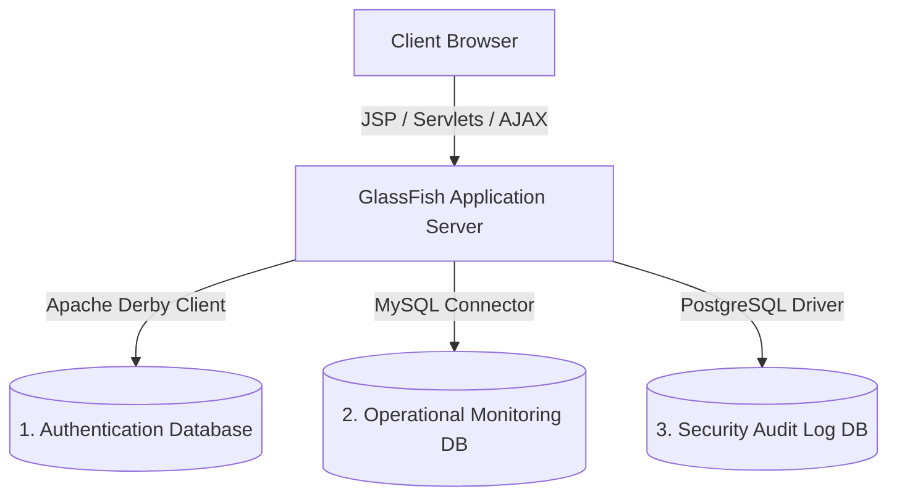

# 🌟 Internship Monitoring & Learning Tracker (OJT-MS)

An enterprise-grade Java EE web application designed to facilitate real-time daily activity tracking, stopwatch attendance logs, coordinator review queues, and secure security audits for student interns (OJT).

The system integrates a unique **Multi-DBMS architecture (3 databases)** to optimize data segregation, operational speed, and append-only audit resilience.

---

## 📐 System Architecture & Multi-DBMS Design

To showcase advanced enterprise data strategies, this application segregates its data models across three separate database engines:



### 1. Apache Derby (Authentication Database)
* **DBMS URL**: `jdbc:derby://localhost:1527/ojt_AuthenticationDB`
* **Username/Password**: `app` / `app` (Standard default)
* **Purpose**: Manages secure user profiles, credentials, role configurations, and demographic information (e.g. Universities, assigned offices) for Interns and Administrators.
* **Tables**:
  - `INTERN` (Demographics, university, office, email, encrypted password, role parameters)
  - `ADMIN` (Name, role code, email, encrypted password)

### 2. MySQL (Operational Monitoring Database)
* **DBMS URL**: `jdbc:mysql://localhost:3306/ojt_monitoringdb`
* **Username/Password**: `root` / `""` (Standard default)
* **Purpose**: Houses the high-frequency daily transaction tables.
* **Tables**:
  - `activity_submissions` (task logs, simulated hours, status, original and renamed file proof-of-work path references).
    - `SUBMISSION_ID` (VARCHAR(30) Primary Key)
    - `USER_ID` (VARCHAR(20) Not Null)
    - `DATE_SUBMITTED` (DATE Not Null)
    - `DESCRIPTION` (TEXT)
    - `SUPPORTING_FILE` (VARCHAR(255))
    - `ORIGINAL_FILE_NAME` (VARCHAR(255))
    - `STATUS` (VARCHAR(20) Default 'Pending')
  - `internship_logs` (stopwatch sessions - logs check-in/check-out timestamps and hours).
    - `LOG_ID` (INT Auto-Increment Primary Key)
    - `INTERN_ID` (VARCHAR(20) Not Null)
    - `LOG_DATE` (DATE Not Null)
    - `TIME_IN` (TIME)
    - `TIME_OUT` (TIME)
    - `RENDERED_HOURS` (DECIMAL(5,2))
    - `COMPLETED_HOURS` (DECIMAL(5,2))

### 3. PostgreSQL (Security Audit Log Database)
* **DBMS URL**: `jdbc:postgresql://localhost:5432/auditdb`
* **Username/Password**: `postgres` / `110705` *(Customizable)*
* **Purpose**: Hosts the secure, append-only security logs recording sensitive system actions (`LOGIN`, `LOGOUT`, `REPORT_GENERATED`) along with timestamps and origin IP addresses.
* **Tables**:
  - `audit_logs`
    - `log_id` (SERIAL Primary Key)
    - `user_id` (VARCHAR(20) Not Null)
    - `username` (VARCHAR(100) Not Null)
    - `action` (VARCHAR(30) Not Null, CHECK (action IN ('LOGIN', 'LOGOUT', 'REPORT_GENERATED')))
    - `details` (VARCHAR(255))
    - `ip_address` (VARCHAR(45))
    - `created_at` (TIMESTAMP Default NOW())
  - **Indexes**:
    - `idx_audit_action` on `audit_logs(action)` (faster dashboard filtering)
    - `idx_audit_user` on `audit_logs(user_id)` (admin-specific timeline tracking)
    - `idx_audit_time` on `audit_logs(created_at DESC)` (chronological loading)

---

## 🛠️ Step-by-Step Installation & Local Setup

### Prerequisites
Before starting, ensure you have the following installed on your machine:
* **Java Development Kit (JDK 8 or JDK 11+)**
* **NetBeans IDE** (with GlassFish Server Integration)
* **MySQL Server** (via XAMPP, WampServer, or Standalone)
* **PostgreSQL Server**
* **Apache Derby DB Server**

---

### Step 1: Clone the Project
Clone the repository to your local NetBeans project workspace:
```bash
git clone -b Kurt https://github.com/andreapaulinetan/OJT-Monitoring-System-Project.git
```

---

### Step 2: Set Up the PostgreSQL Database
1. Open your PostgreSQL terminal (`psql`) or **pgAdmin**, and run:
   ```sql
   CREATE DATABASE auditdb;
   ```
2. Connect to the `auditdb` database, and execute the initialization script located at:
   👉 **`database/seed_postgres.sql`**
3. Open **`web/WEB-INF/web.xml`** and configure your local PostgreSQL credentials:
   ```xml
   <context-param>
       <param-name>pgsql.username</param-name>
       <param-value>postgres</param-value>
   </context-param>
   <context-param>
       <param-name>pgsql.password</param-name>
       <param-value>your_local_postgresql_password</param-value>
   </context-param>
   ```

---

### Step 3: Set Up the MySQL Database
1. Open your MySQL terminal or **phpMyAdmin**.
2. Run the database schema initialization script:
   👉 **`database/ojt_monitoringdb.sql`**
   *(This script automatically creates the `ojt_monitoringdb` database, creates tables, and seeds mock submissions.)*
3. Open **`web/WEB-INF/web.xml`** and set your local MySQL password:
   ```xml
   <context-param>
       <param-name>mysql.password</param-name>
       <param-value>your_mysql_password</param-value>
   </context-param>
   ```

---

### Step 4: Open & Compile in NetBeans
1. Launch **NetBeans IDE** and select **File > Open Project**.
2. Select the cloned `OJT-Monitoring-System-Project` directory.
3. Click the **"Clean and Build Project"** (Hammer & Broom) icon.
   *(This automatically bundles the preloaded JDBC driver libraries for MySQL, Derby client, PostgreSQL, and PDF reporting into the deployed war ClassLoader).*
4. Go to the **Services** tab in NetBeans, right-click **GlassFish Server**, and click **Start** (or **Restart**).
5. Run the project to deploy the application in your browser!

---

### 🔍 Connection Diagnostic Tool
We have built a custom, real-time database connection diagnostics dashboard directly inside your server deployment context.
To test whether GlassFish can successfully communicate with all 3 of your databases, launch the application and navigate to:
👉 **`http://localhost:8080/OJT-Monitoring-System-Project/scratch_test_db.jsp`**

---

## 💎 Features Checklist

- [x] **Secure Authentication Routing**: Built-in auth filters block unauthorized direct access to panel pages.
- [x] **Real-Time Attendance Stopwatch**: Log exact worked shifts via the "Time In / Time Out" dashboard widget.
- [x] **Dynamic Calendar Tracker**: Interactive uniform aspect-ratio calendar displaying daily workload goals.
- [x] **Simulated Hours Controls**: Integrated setup card to dynamically change target hour projections or instantly reset hours.
- [x] **Real-time Database Syncing**: Logs and uploaded attachments are queued in real time for Coordinator approval.
- [x] **Automatic Security Audit Log**: PostgreSQL logs login/logout/report generation actions with IP mapping.
- [x] **Personal Record Downloads**: Interns can download personal landscape A4 PDF records of their OJT logs with a single click.

---

## 🔒 Security, Error Masking & Non-Functional Parameters

### 🛡️ Error Masking & Exception Handling
- **No Stack Trace Exposure**: All catch blocks in DAOs and Controller Servlets route tracing details through `util.ErrorLogger` to output dynamic files internally (`/logs/session_[ID]_errors.log` or `system_global_errors.log`), rather than triggering `e.printStackTrace()` to leak internal directory structures or query structures to system consoles or user interfaces.
- **Custom Error Route Targets**: Configured in `web.xml` for status codes `400`, `403`, `404`, and `500` to mask raw GlassFish server logs under custom-styled error screens.

### 🛡️ Core Security Features
- **Cross-Site Request Forgery (CSRF) Prevention**: Forms and async AJAX update requests require token checking via `CsrfUtil` validating against the current session states.
- **Multi-Tab Session Isolation**: To prevent tab-crossover pollution, session details are mapped using a dynamic `tabId` generated per browser tab and managed by `TabSessionHelper`.
- **SQL Injection Prevention**: All queries across Derby, MySQL, and PostgreSQL are handled via `PreparedStatement` query parametrization.
- **Secure PDF Generation**: File streams are output directly on-the-fly (`response.getOutputStream()`) in rotated landscape A4 layout. Password hashes are never queried, logged, or included.

### 🚀 Performance Optimization
- **N+1 Query Starvation Resolution**: Refactored `UserDAO.mapResultSetToUser` with `fetchStatus` controls to prevent sub-queries on row-by-row lookups. Running a dashboard listing or bulk mapping now triggers only one single database fetch query instead of launching `O(N)` MySQL connections.
