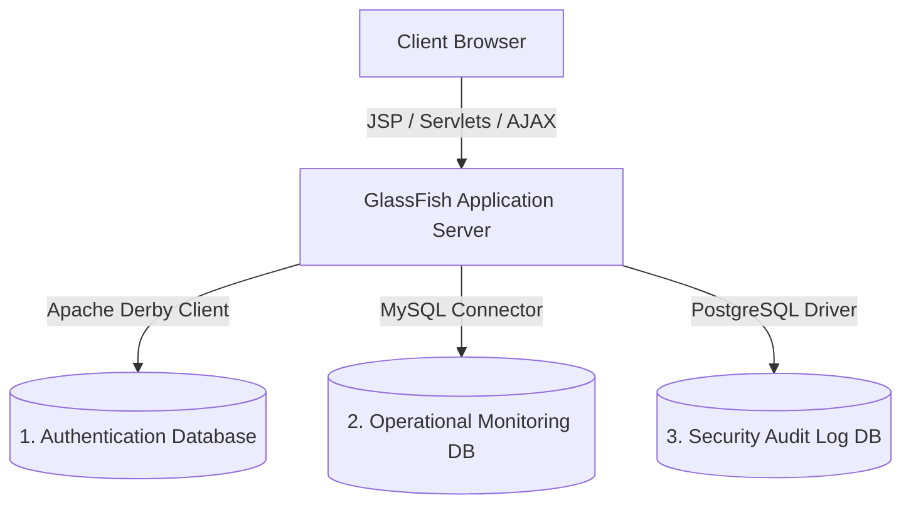

# 🌟 Internship Monitoring & Learning Tracker (OJT-MS)

A robust, enterprise-grade Java EE web application designed to facilitate real-time daily activity tracking, stopwatch attendance logs, coordinator review queues, and secure security audits for student interns (OJT).

The system integrates a unique **Multi-DBMS architecture (3 databases)** to optimize data segregation, operational speed, and append-only audit resilience.

---

## 📐 System Architecture & Multi-DBMS Design

To showcase advanced enterprise data strategies, this application segregates its data models across three separate database engines:



### 1. Apache Derby (Authentication Database)
* **DBMS URL**: `jdbc:derby://localhost:1527/ojt_AuthenticationDB`
* **Username/Password**: `app` / `app` (Standard default)
* **Purpose**: Manages secure user profiles, credentials, role configurations, and demographic information (e.g. Universities, assigned offices) for Interns, Supervisors, and Administrators.

### 2. MySQL (Operational Monitoring Database)
* **DBMS URL**: `jdbc:mysql://localhost:3306/ojt_monitoringdb`
* **Username/Password**: `root` / `""` (Standard default)
* **Purpose**: Houses the high-frequency daily transaction tables: `activity_submissions` (task logs, simulated hours, and uploaded JPEG/PNG proof-of-work images) and `internship_logs` (stopwatch sessions).

### 3. PostgreSQL (Security Audit Log Database)
* **DBMS URL**: `jdbc:postgresql://localhost:5432/ojt_auditdb`
* **Username/Password**: `postgres` / `110705` *(Customizable)*
* **Purpose**: Hosts the secure, append-only security logs recording system actions (`LOGIN`, `LOGOUT`, `REPORT_GENERATED`) along with timestamps and origin IP addresses.

---

## 🛠️ Step-by-Step Installation & Local Setup

### Prerequisites
Before starting, ensure you have the following installed on your machine:
* **Java Development Kit (JDK 8 or JDK 11+)**
* **NetBeans IDE** (with GlassFish Server Integration)
* **MySQL Server** (via XAMPP, WampServer, or Standalone)
* **PostgreSQL Server**

---

### Step 1: Clone the Project
Clone the repository to your local NetBeans project workspace:
```bash
git clone -b Kurt https://github.com/andreapaulinetan/OJT-Monitoring-System-Project.git
```

---

### Step 2: Set Up the PostgreSQL Database
1. Open your PostgreSQL terminal (`psql`) or **pgAdmin**, and run:
   ```sql
   CREATE DATABASE ojt_auditdb;
   ```
2. Connect to the `ojt_auditdb` database, and execute the initialization script located at:
   👉 **`database/seed_postgres.sql`**
3. Open **`web/WEB-INF/web.xml`** and configure your local PostgreSQL password:
   ```xml
   <context-param>
       <param-name>pgsql.password</param-name>
       <param-value>your_local_postgresql_password</param-value>
   </context-param>
   ```

---

### Step 3: Set Up the MySQL Database
1. Open your MySQL terminal, pgAdmin, or **phpMyAdmin**.
2. Run the database schema initialization script:
   👉 **`database/ojt_monitoringdb.sql`**
   *(This script automatically creates the `ojt_monitoringdb` database, creates all tables with safe general collations, and seeds mock submissions.)*
3. If your local MySQL root user has a password, configure it in **`web/WEB-INF/web.xml`**:
   ```xml
   <context-param>
       <param-name>mysql.password</param-name>
       <param-value>your_mysql_password</param-value>
   </context-param>
   ```

---

### Step 4: Open & Compile in NetBeans
1. Launch **NetBeans IDE** and select **File > Open Project**.
2. Select the cloned `OJT-Monitoring-System-Project` directory.
3. Click the **"Clean and Build Project"** (Hammer & Broom) icon.
   *(This automatically bundles the preloaded JDBC driver libraries for MySQL, Derby client, PostgreSQL, and PDF reporting into the deployed war ClassLoader).*
4. Go to the **Services** tab in NetBeans, right-click **GlassFish Server**, and click **Start** (or **Restart**).
5. Run the project to deploy the application in your browser!

---

### 🔍 Connection Diagnostic Tool
We have built a custom, real-time database connection diagnostics dashboard directly inside your server deployment context.
To test whether GlassFish can successfully communicate with all 3 of your databases, launch the application and navigate to:
👉 **`http://localhost:8080/OJT-Monitoring-System-Project/scratch_test_db.jsp`**

---

## 💎 Features Checklist

- [x] **Secure Authentication Routing**: Built-in auth filters block unauthorized direct access to panel pages.
- [x] **Real-Time Attendance Stopwatch**: Log exact worked shifts via the "Time In / Time Out" dashboard widget.
- [x] **Dynamic Calendar Tracker**: Interactive uniform aspect-ratio calendar displaying daily workload goals.
- [x] **Simulated Hours Controls**: Integrated setup card to dynamically change target hour projections or instantly reset hours to `0h`.
- [x] **实时 Database Syncing**: Logs and uploaded attachments are queued in real time for Coordinator approval.
- [x] **Automatic Security Audit Log**: PostgreSQL logs login/logout tracking.
